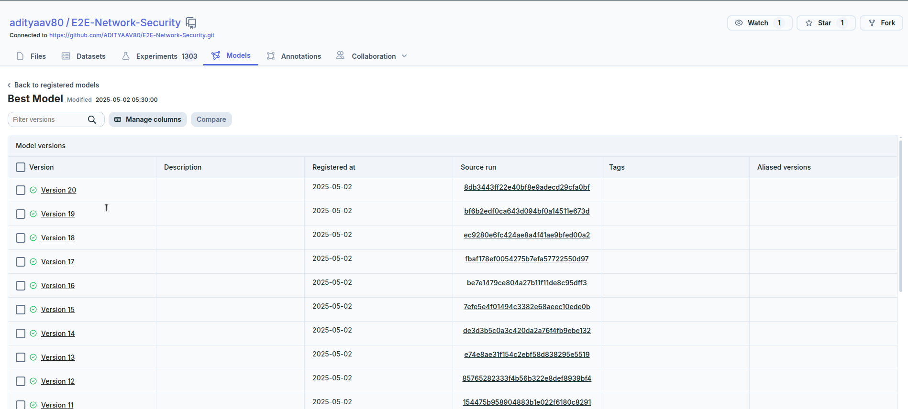

# E2E-Network-Security

## Pre - Requisites to run this file

1. Install ansible
2. Install minikube
3. Create an account in Dagshub
4. Create an account in MongoDB Atlas
5. Create an account in DockerHub
6. Create an account in Send Grid
7. Add the following secrets in Repository Secrets
   1. ANSIBLE_VAULT_PASSWORD
   2. DOCKERHUB_TOKEN
   3. DOCKERHUB_USERNAME
   4. MLFLOW_TRACKING_PASSWORD
   5. MLFLOW_TRACKING_URI
   6. MLFLOW_TRACKING_USERNAME
   7. MONGO_DB_URL
8. Create a file in ansible/vars/vault-env.yaml encypt it and save it password as ANSIBLE_VAULT_PASSWORD
   ```
   env_vars:
    MONGO_DB_URL: "xxxx"
    JWT_SECRET_KEY: "xxxx"
    MLFLOW_TRACKING_USERNAME: "xxxx"
    MLFLOW_TRACKING_PASSWORD: "xxxx"
    MLFLOW_TRACKING_URI: "xxxx"
    DAGSHUB_USER_TOKEN: "xxx"
    MAIL_DEFAULT_SENDER: "xxxx"
    SEND_GRID: "xxxx"
   ```
10. Need to change all deployment files especially those associated with Docker to your username
    1. ansible/deployment.yaml - replace adityaav80 with your username
    2. ansible/ingress.yaml - replace host: "192.168.49.2.nip.io" with "<minikube-ip>.nip.io"
    3. ansible/playbook.yaml - replace vars
    4. ansible/roles/prereqs/tasks/main.yaml - replace path of installation of conda
11. Replace all file paths in backend/config.config.yaml
12. Install all requirements from requirements.txt
13. Install following minikube add-ons most of them are installed by default ingress, metrics-server needs to be installed


## Steps taken to build the project

1. Run template.py - Creates a directory structure
2. Edit, Configure & Test - backend/src/NetworkSecurity/logging/logger.py
3. Edit, Configure & Test - backend/src/NetworkSecurity/exception/exception.py
4. Create a Mongo DB Atlas account download API Key and have a sample file to test connection check_connection.py
5. Edit, Configure & Test - backend/src/NetworkSecurity/utils/common.py. Create utilities for 
   1. Reading YAML File
   2. Create Directories
6. Create backend/config/config.yaml  - for all filepaths, filenames, model names
7. Create backend/params.yaml - for all parameters that we pass into model
8. Create backend/schema.yaml - for model validation keep column names and data types
9. Store the path of these files relative to root in constants/__init__.py
10. Create a jupyter notebook and create the following 5 modules once it works in notebooks modularize them
    1. Data Ingestion
    2. Data Validation
    3. Data Transformation
    4. Model Selection
    5. Model Evaluation
11. Create a main.yaml file and a pipeline to Integrate all the 5 steps mentioned above with no frontend/ minimal frontend 
12. Create a basic github actions file to push the image to DockerHub
13. Use Ansible to download the image and create a running container
14. Update all these steps in Github Actions
15. Modularize Ansible files
16. Create a full fledged frontend
17. Create seperate Docker files for frontend and backend
18. Use multi-stage builds to reduce the size of containers
19. Integrate ansible playbook & Github workflow to integrate this

## Preview of the project

1. Kubernetes Pods, Service, Deployment, HPA Status before pushing code to Github

2. Git commit to push code to Github

3. We need to download, install and enable Github Actions Runner

4. Also we need to ensure minkube is up and running

5. Once git commit is done it triggers workflow

6. If all goes well the ansible notebook is triggered via runner

7. Wait for a few minutes for pods to be up and running

8. Go to http://minikube-ip.nip.io/ to see application

### App demo

Customer Login and Prediction


Customer Signup


Developer Login and Train


9. Stress Testing the App 

During Scaling


After Testing it scales down automatically


### Features

1. Sends automated mail once pipeline is trained
    

2. Automatically loads the best trained model from Dagshub and versions it for every retrain compare results by visiting dagshub repository

    
    
    


## Other Info

1. Change config file in frontend/src/config/appConfig.js as stated to work with it locally before deploying it in minikube
    ```
    export const appConfig = {
    backendURL: "http://192.168.49.2.nip.io/api"
    // http://0.0.0.0:9000/api to test in local
    };
    ```

2. Once cluster is created in MongoDB allow access for all IP's by setting it for 0.0.0.0

## Useful links 
https://app.sendgrid.com/

https://www.mongodb.com/

https://dagshub.com/

https://hub.docker.com/